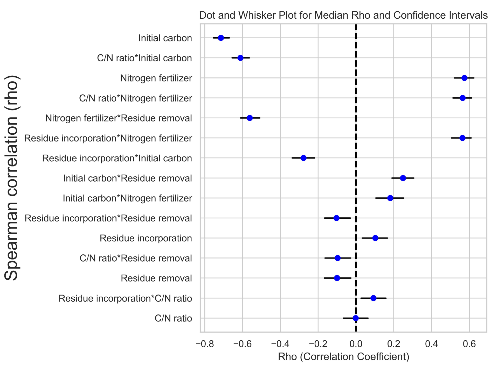

https://onlinelibrary.wiley.com/doi/full/10.1111/gcb.16632  
this paper used some of the data from the morrow plots and evaluated cover crop adoptions.

the paper also dicsusses initial soil carbon clay content and planting as the intitial factors that are likely to affect soil organic carbon

impact of cover crop on soybean and maize yield is relatively neutral for legumnous crops and 3.9% reduction for non legumnous crops

[file:///C:/Users/rmagala/Box/PhD thesis/objective five/impacts of cover crop on maize yield.pdf](file:///C:/Users/rmagala/Box/PhD%20thesis/objective%20five/impacts%20of%20cover%20crop%20on%20maize%20yield.pdf)

cover crops has neutral effect on soyyield

https://onlinelibrary.wiley.com/doi/full/10.1111/gcb.14644  
found 4% yield penalty of cover crop in relation to control of no cover crop

* * *

the stover for grain maize is expected to be higher atleast about twice as that of small grain cereals, and have highe lignin content  
MAize is also highly fertilized than wheat.

https://acsess.onlinelibrary.wiley.com/doi/abs/10.2134/agronj2004.1000a

* * *

in this region of the U.S., Midwest, corn is a major cash crop, and stiver is increasingly being considered for cellulosic biofuel.

https://link.springer.com/article/10.1007/s11027-020-09916-3  
Nitrogen fertilization had a low stock rate change.

&nbsp;

https://onlinelibrary.wiley.com/doi/full/10.1111/gcb.12145

this study shows that soc began to decline when residue was greater than 50%

fertilization had  an appositive effect, especially in the range of 0-50 kg N

&nbsp;

for the morrow plots, the low planting density and the changes in tillage depth were associated with the decreasing SOC trend; over time, the scenarios analysis shows that a high planting density and N fertilization arrested this trend, but it was not a definite one as carbon started declining after 94 years. This is consistent with the saturation model, where SOC inputs exceeds the soil carrying capacity of soils and starts declining.

they say that without considering these nuances, uniform agricultural management could lead to different outcomes for SOC in different locations.

initial SOC negatively influences SOC, but the interaction with the residue was not significant

The effects of residue removal on soil organic carbon (SOC) varied based on the nitrogen (N) rate. The different in SOC among the different combinations of residue retention and N application rate could be seen as potential trade-offs between environmental benefits for SOC sequestration and the end goal for residue removal such as producing cellulosic ethanol biofuel. While the trade-offs in SOC benefits are clear across different residue and nitrate rates, these suggests that discussions regarding the best strategy to harvest residue rate should consider the N application rates. This is because high fertilization tended to arrest soc loss when residues were removed on site.

Nitrogen fertilization influences residue biomass and the questions have been whether high high fertilization rate can offset soil organic carbon loss? Our analysis suggests that achieving a significant increase in soil organic carbon may not be answered by high N rates because they were was minimal difference from agronomicall optimal n rate with the high Nra

https://onlinelibrary.wiley.com/doi/full/10.1111/gcb.12519

excessive N fertilizer application rate had little effect on SOM

residue input

there was no difference between SOC amount between 202 and 269 Kg N rate.

in our study, there were very minimal differences in the soil organic carbon between the high N rates;. In contrast, this difference is not significant; the difference between the N rates is high and could make a very significant difference in the other associated negative footprint of nitrous oxide emissions and nitrate pollution. High n rates is associated with high nitrous oxide emissions.

https://doi.org/10.1111/gcb.12519

physiochemically protected soc was not affected by N fertilizer rate or residue inputs. However, unprotected particulate organic matter (POM)

the unprotected carbon was affected by residue input and N fertilizer application rate

Natural climate solutions for the United States. Fargione et al, 2018

https://www.science.org/doi/10.1126/sciadv.aat1869

Climate-smart soils paustian

Liu et al. ([2014](https://link.springer.com/article/10.1007/s11027-020-09916-3#ref-CR34 "Liu C, Lu M, Cui J, Li B, Fang C (2014) Effects of straw carbon input on carbon dynamics in agricultural soils: a meta-analysis. Glob Chang Biol 20:1366–1381")) found that RR decreased with increasing initial SOC content for straw residue inc\`\`\`\`orporation, indicating that for a given amount of C inputs to soil, the percentage change is less for soils with a larger initial SOC stock, which is in agreement with the trend reported by Minasny et al. ([2017a](https://link.springer.com/article/10.1007/s11027-020-09916-3#ref-CR44 "Minasny B, Malone BP, McBratney AB et al (2017a) Soil carbon 4 per mille. Geoderma 292:59–86")).

* * *

- N fertilizers does not only benefit SOC sequestration but also influence nitrous oxide emissions that determine whether SOC sequestration benefits to climate change can be realized or not. The lower nitorgen use efficience of cereals begs for improved nitrogen management to optimize soc sequestration and crop yield Sheila F. Christopher & Rattan Lal (2007)

* * *

- Many factors influence SOC sequestration from residue, of which amount returned is the primary factor, residue return has been associated with 12% increase in SOC (Lal 2014). other factors includes the N rate application. Apostive impact of n RATE on residue benefit to SOC sequestration have been reported from short experimental trial Jacinthe(2002), but none of these studies investigate various N rates impact and how the impact of split N rate application. Using a process-based model, Zhao et al (2013) found that the impact of N rate on residue carbon was non-linear, and found rates within 0-50 kg to be more effective than high N rates). however this analysis is yet to be cnducted on corn cropping sytems, which have high N requirements than wheat. Corn also have higher net primary productivity than wheat and produced more residue biomass than wheat and

* * *

- Many factors influence SOC sequestration from residue, of which amount returned is the primary factor, residue return has been associated with 12% increase in SOC (Lal 2014). Using a process-based model, Zhao et al (2013) found that the impact of N rate on residue carbon was non-linear, and found rates within 0-50 kg to be more effective than high N rates across most of the simulated areas in Australia. However this analysis is yet to be cnducted on corn cropping sytems, which have high N requirements than wheat and produces more residue biomass than wheat. Previous analysis at the Morrow plots has shown that there was minimal differences in SOC when the experiment was switched from high N rates and high residue retention (Khan et al 2007). However, it is not clear about what causeed this changes.
- * * *
    

* * *

- Therefore, the impacts on SOC are generally expected to be greater for grain-maize because the potential aboveground crop residues represent approximately twice the amount that of small-grain cereals

* * *

High inorganic nitrogen (N) increases microbial carbon use efficiency. This is the fundamental reason why splitting N application rate reversed the trend of soil organic carbon (SOC) from N and residue interactions. Generally the mean carbon and trends detected in this study suggests that fertilization has relatively little effect on SOC when applied in excess.

* * *

How to measure, report and verify soil carbon change to realizethe potential of soil carbon sequestration for atmosphericgreenhouse gas removal  
Smith et al (2020)  
https://onlinelibrary.wiley.com/doi/epdf/10.1111/gcb.14815

* * *

unprotected SOC pool increases with increase in residue input (Brown et al 2014)

\=========================================================  
https://acsess.onlinelibrary.wiley.com/doi/pdfdirect/10.2134/agronj2004.1000a  
Crop and Soil Productivity Response to Corn Residue Removal: A Literature Review

* * *

Morrow plots filepath  
fpath = "C:\\Users\\rmagala\\OneDrive\\simulations\\Data-analysis-Morrow-Plots\\APSIMX FILES "

* * *

The decrease in residue content had a negative linear effect, as shown in Figure 3. This effect was because APSIM associated a specific reduction in residue with a certain portion of the soil organic carbon (SOC) pool that cannot be replenished.

The low SOC benefits associated with high residue removal correspond to the assumption that APSIM links incorporated residue to the FOM pool  , and removed residue can not be incorporated into the soil. However, this pool is not physiochemically protected from degradation and can be attacked by microbial decomposition

* * *

Factorial simulations of N fertilization and residue retention indicated that for single fertilizer application, higher N fertilizer rates are necessary to maintain high SOC when less than 50% of residues are left on-site. However, with residue incorporation rates greater than 50%, higher fertilizer application rates did not maintain high SOC relative to the intermediate fertilizer application rate of 165 kg N ha\-1. For split N fertilizer application, higher application rates result in higher SOC than fertilizer application rates of less than 165 kg N ha\-1. These results can guide targeted residue harvest for other purposes such as second generation biofuels.

* * *

* * *

* * *

This paper https://www.sciencedirect.com/science/article/pii/S0167880910003257#fig0010 calculates the meanresponse ratio

# Research questions.

How Does the Interaction Between Initial Carbon Stock and Nitrogen Management Strategies Influence Soil Organic Carbon Dynamics in Corn Systems?

What Role Does Residue Management Play in Enhancing Soil Organic Carbon When Combined with Nitrogen Fertilization in Corn-Based Agroecosystems?

* * *

## Results

&nbsp;

Relationships between management practices, environmental variables, and changes in soil organic carbon (SOC).

The analysis presented in Table 4.5 highlights the interaction of soil physical factors such as Initial carbon content, Initial carbon to nitrogen ration and management factors such tillage, residue removal residue retention, N application strategy, on SOC dynamics in corn farming systems. The most notable finding is the strong negative correlation between initial carbon stock (IC) and changes in SOC, indicating that higher initial carbon levels are associated with reduced SOC accumulation or even losses. Conversely, nitrogen application and its interaction with residue management and application strategies exhibit strong positive correlations with SOC, implying that as residue and nitrogen increases so does the SOC content, intial soil organic matter C/N had no impact on SOC but its interaction with residue incorporation, removal and N application rate was significant. Residue removal had a negative effect on soil organic carbon as shown by negative spearman rank correlation coefficient and was very high when residues were incoporated at higher depth than at low depth.

emphasizing the importance of balanced nitrogen management and residue retention in enhancing SOC levels. Additionally, while some interactions, such as IC combined with nitrogen strategy (NS), negatively influence SOC, others, like the interaction between nitrogen and residue, positively contribute to SOC gains, underlining the complexity and interdependence of these factors in soil carbon management. These results underscore the need for integrated management practices that consider both individual and combined effects of various agronomic factors on SOC.

There was no signiifcant changes in the SOC benefits as driven by higher SOC above 244, the agronomicaly optimum rate. the difference in application strategy was significant at lower N rates than at higher rates.

* * *

Synthetic N addition increases soil respiration and carbon mineralization Meng Lu et al (2011)  
https://doi.org/10.1016/j.agee.2010.12.010  
similar findings in iowa weref ound by Kimberly et al

* * *

# Data analysis

Spearman correlation coefficients were used to assess the association between various management factors (residue retention, residue removal, N application strategy, N fertilization), soil physical factors (initial surface organic matter carbon to nitrogen ratio, initial carbon content), and their interaction effect on the changes in SOC. Changes in SOC were calculated as the difference in the SOC between the start and end of the simulations (105 years). Spearman’s correlation coefficient (rho) measures a monotonic association, making it less restrictive than the Pearson correlation coefficient, which assumes a normal distribution of data (Yu and Hutson, 2024). The Spearman correlation was preferred over the Pearson correlation method because simulated data encompassing various interactions from different factors rarely conform to a normal distribution. In this type of test, the null hypothesis shows that both dependent and independent variables are independent of each other and lack a monotonic association. The management factors and soil physical properties were considered as the independent variables, and the change in SOC was the dependent variable. The sign of rho, positive or negative, between the independent and dependent variables, indicates the direction of association between the variables. A rho closer to -1 or 1 indicates a strong negative or positive association, respectively. The results of the bootstrapped samples (n=1000) were grouped and tabulated by the independent variables, along with their corresponding lower and higher confidence levels intervals. The medium percentile of the rho was plotted as bar graphs and sorted by the significance levels.

- response ratio were used to assess the interaction between residue and Nitrogen rate application and their impact of SOC stocks. this was geared towards understanding which n rate could maintain high soil organic carbon stock. the rolling mean with a window of 5 years was used. response ratios were compared to zero treatment.  
    RR =

* * *

# Discussion

- The main drivers of changes in soil organic carbon (SOC) benefits were nitrogen as the most predominant soil management decision, followed by residue retention. This contrasts with Zhao's (2013) findings, which identified residue as the most dominant management practice. The discrepancy can be explained by the high residue biomass produced by corn driven by nitrogen fertilization. The interaction effect of residue and nitrogen fertilizer application rate on SOC benefits was substantial, as high residue incorporation and nitrogen fertilization prevented the decline in lower fertilization application rates. This implies that effective SOC management through residue harvest needs to align with the amount of biomass at the site, primarily driven by nitrogen fertilization.
    
- &nbsp;
    
    The analysis revealed a significant negative interaction effect between residue incorporation and initial carbon levels on SOC changes. On an individual level, residue incorporation had a significant positive correlation coefficient, while initial carbon had a strong negative correlation coefficient. This suggests that the expected benefits of residue incorporation for SOC enhancement may be diminished in soils with higher initial carbon stocks. This is consistent with experimental studies that have found SOC decline with increased residue incorporation under high initial carbon (Liu et al., 2014). The interaction indicates that high initial carbon may accelerate decomposition processes or reduce the efficiency of residue incorporation, leading to lower-than-expected SOC gains. These findings underscore the complexity of managing soil organic carbon, particularly in systems where initial carbon levels are already elevated, and highlight the need for tailored residue management strategies that consider existing soil carbon conditions to maximize carbon sequestration.
    
- &nbsp;
    
    Residue incorporation generally had a lower impact on soil organic carbon (SOC) compared to fertilizer application when considered on an individual level. This outcome can be attributed to the carbon saturation effect, where soils with substantial levels of organic carbon are less responsive to additional carbon inputs, such as those from residue incorporation. The potential for further SOC increase in these soils is limited because the soil has reached or is nearing its capacity to stabilize additional organic carbon. Residue removal, the inverse of residue incorporation, demonstrated negative impacts on SOC benefits. This is because, in the APSIM model, residue retention is closely linked to replenishing the organic matter pool, a critical component of SOC dynamics. Residue removal, therefore, signifies that a portion of the organic inputs that would normally contribute to sustaining or increasing the organic matter pool is instead removed, leading to a missed SOC gain. This underscores the importance of residue retention in maintaining soil health and carbon storage, as removing residues disrupts the natural replenishment cycle of organic matter.
    
- &nbsp;
    
    The combined effect of residue incorporation and nitrogen fertilization was higher than that of residue incorporation alone. This synergy suggests that nitrogen fertilization enhances the process of residue decomposition and integration into the soil organic matter pool (Kirkby et al., 2013), possibly by stimulating microbial activity or improving the overall nutrient balance, promoting greater residue production. Kimberly (2014) found that residue mass increased with increased nitrogen rate.  thus, this explains the high interaction effect of residue and N application. This finding emphasizes the importance of considering both nutrient management and organic matter inputs to achieve more effective SOC enhancement in agricultural systems.